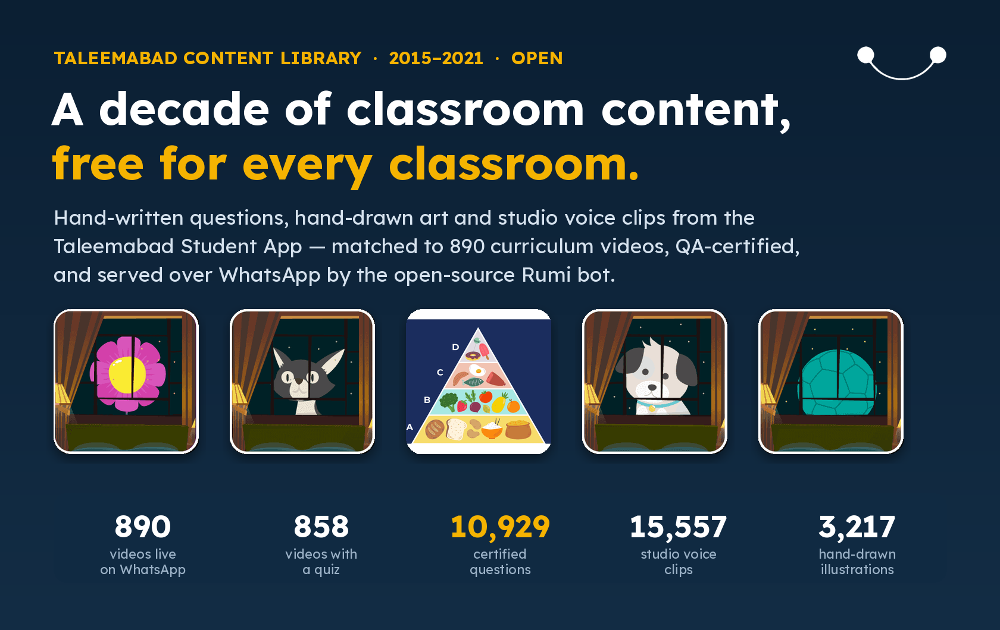
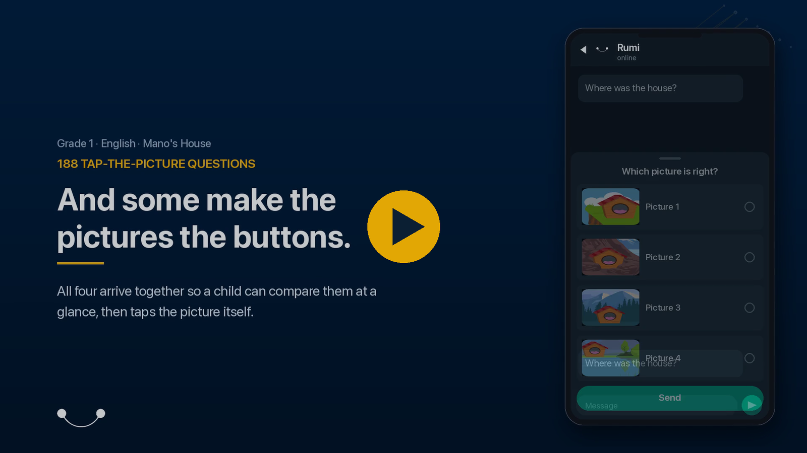
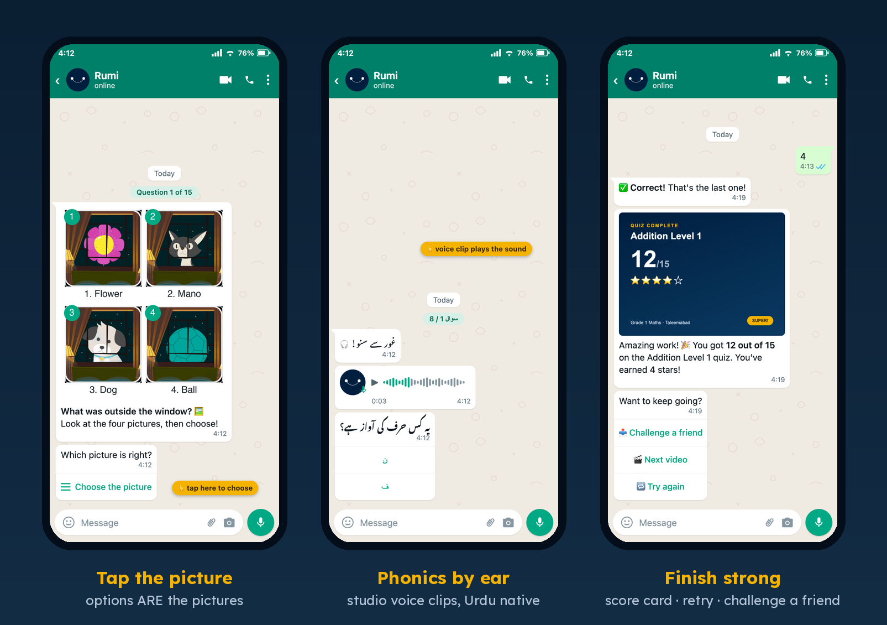

<p align="center">
  
</p>

<h1 align="center">Rumi</h1>

<p align="center">
  <strong>The open-source AI teaching assistant that lives on WhatsApp</strong><br>
  You're not teaching alone.
</p>

<p align="center">
  <a href="#quick-start">Quick Start</a> &middot;
  <a href="#what-rumi-does">Features</a> &middot;
  <a href="#-languages">Languages</a> &middot;
  <a href="#-the-taleemabad-content-library">Content Library</a> &middot;
  <a href="#-built-to-be-run-by-an-ai-agent">Agent-Native</a> &middot;
  <a href="#documentation">Docs</a> &middot;
  <a href="https://hellorumi.ai">Website</a>
</p>

<p align="center">
  <a href="LICENSE"></a>
  <a href="https://github.com/Orenda-Project/rumi-platform/actions/workflows/ci.yml"></a>
  
  
  
  
</p>

<p align="center">
  
</p>

---

**Rumi gives every teacher a coach in their pocket.** It runs entirely on WhatsApp — the app teachers already
have — and offers classroom coaching on real lessons, reading assessments from a voice note, lesson plans,
curriculum quizzes, and professional development, in the teacher's own language, 24 hours a day.

It is built to be **cloned and run by anyone**. Bring your own API keys, point it at a WhatsApp number, and
you have a teaching assistant for your schools — no commissioning, no vendor, no lock-in.

<table>
<tr><td><b>Meets teachers where they are</b></td><td>No app to install, no login to remember, no training day. If a teacher can send a WhatsApp message, they can use Rumi.</td></tr>
<tr><td><b>Coaches right after the lesson</b></td><td>A teacher records their class and gets a framework-scored report plus a reflective conversation — while the lesson is still fresh, not at an annual workshop.</td></tr>
<tr><td><b>Hears children read</b></td><td>A student reads aloud into a voice note; Rumi returns words-per-minute, accuracy, pronunciation and comprehension against grade benchmarks.</td></tr>
<tr><td><b>Ships with real content</b></td><td>890 curriculum videos, 10,929 QA-certified questions, 15,557 voice clips and 3,217 illustrations — free, CDN-hosted, one command to import.</td></tr>
<tr><td><b>Speaks their language</b></td><td>15 languages for chat, voice-note transcription and spoken replies — including a full Indian-language suite and Pakistan's regional languages.</td></tr>
<tr><td><b>Try it without Meta</b></td><td>Link your own WhatsApp with a QR code and start chatting in about fifteen minutes. No Business account, no app review, no waiting.</td></tr>
<tr><td><b>Set up by talking to it</b></td><td>The repo is agent-native: open it in Claude Code, Cursor or Codex and say "set me up". Or run one guided wizard that asks in plain language and checks every answer for you.</td></tr>
<tr><td><b>Your keys, your data</b></td><td>Your Supabase, your WhatsApp number, your model provider. Nothing routes through us. Apache-2.0.</td></tr>
</table>

---

## Quick Start

```bash
# 1. Fork this repo on GitHub, then clone YOUR fork
git clone https://github.com/YOUR-ORG/rumi-platform.git
cd rumi-platform

# 2. Install — tools, dependencies, and the `rumi` command
./install.sh

# 3. Connect Rumi to your accounts — guided, one question at a time
rumi setup

# 4. Start it
rumi start
```

Then message the number Rumi linked and send **`Hi`**.

**About fifteen minutes**, most of it waiting for a Supabase project to start. `rumi setup` asks in plain
language rather than by variable name ("where should Rumi keep its memory", not `SUPABASE_URL`), checks every
value against the real service as you type it, creates the whole database for you, and saves each answer as
it goes — so Ctrl+C is safe and running it again picks up where you stopped.

### Important: you need a second phone number to test from

> ⚠️ By default Rumi links **your own** WhatsApp account, the same way WhatsApp Web does — so Rumi *is* your
> number. You cannot have a useful conversation with yourself, so you need a **different** number to message
> it from.
>
> Any of these works: a spare SIM, an old phone, a work phone, a family member's phone, or a second WhatsApp
> account logged into WhatsApp Web in your browser. Both numbers need WhatsApp installed and active.
>
> If you skip this you will pair successfully, send a message, and see nothing happen — not because anything
> is broken, but because Rumi is on the other end of your own chat.

### What you need

| | Where to get it | What it's for | Cost |
|---|---|---|---|
| **Node.js 20+** and **git** | [nodejs.org](https://nodejs.org) | Running Rumi | free |
| **A Supabase project** | [supabase.com](https://supabase.com) | Where Rumi remembers teachers, lessons and assessments | free tier is plenty |
| **An OpenRouter key** | [openrouter.ai/keys](https://openrouter.ai/keys) | How Rumi thinks — one key, 500+ models | a few dollars goes a long way |
| **A Redis address** | [Upstash](https://upstash.com) · [Railway](https://railway.app) · or local Docker | Conversations in progress, and background jobs | free tier is plenty |
| **WhatsApp on your phone** | — | The number Rumi answers as | free |
| **A second number with WhatsApp** | a spare SIM, old phone, or colleague | The number you message Rumi *from* — see above | free |

The wizard offers to start Redis locally with Docker if you have it, so that row is often one keypress.
**A Meta WhatsApp Business account is not required** to try Rumi — see [the two ways to run
it](#the-two-ways-to-run-rumi).

Optional feature keys (Soniox, ElevenLabs, Uplift, Gamma, Kie.ai, Azure, Mistral) unlock the features that
use them, and only those. `rumi setup` offers them at the end and skipping is a real answer — every one can be
added later by setting its key. Each is documented in [`.env.template`](.env.template).

### The `rumi` command

| Command | What it does |
|---|---|
| `rumi setup` | Connect Rumi to your accounts. **Start here.** `--reconfigure` re-asks everything. |
| `rumi start` | Start Rumi |
| `rumi status` | Is Rumi running, which WhatsApp number it answers as, what's switched on |
| `rumi doctor` | Check every connection in detail, with where to get anything missing |
| `rumi pair` | Link (or re-link) WhatsApp — sessions do expire |
| `rumi graduate` | Move to an official WhatsApp Business number |

If `install.sh` could not put `rumi` on your PATH, `node bin/rumi.js <command>` is identical.

**Would rather not type it yourself?** Open the repo in a coding agent (Claude Code, Cursor, Codex) and say
*"set me up"* — it walks you through the same sequence in conversation, following the
[`/setup`](.claude/skills/setup/SKILL.md) skill. Setting up a real deployment (hosting, the Meta webhook,
WhatsApp Flows, background workers), or prefer the manual route? **[SETUP.md](SETUP.md)** has the full
walkthrough, including getting a WhatsApp number from scratch.

---

## The two ways to run Rumi

Rumi's messaging channel is pluggable. You pick one during setup, in plain language, and you can change your
mind later.

|  | **Just trying it out** | **Real deployment** |
|---|---|---|
| **What it is** | Rumi becomes a linked device on your own WhatsApp, exactly like WhatsApp Web | An official WhatsApp Business number through Meta's Cloud API |
| **To get started** | Scan a QR code. ~2 minutes. | A Meta Business account, a verified number, and their app-review process |
| **Good for** | Evaluating, demos, development | Schools, districts, anything with real teachers on it |
| **Limits** | One personal account; WhatsApp may disconnect it. Tap-through forms, approved templates and picture-menu carousels are Meta-only — Rumi asks the same questions as an ordinary chat instead, so nothing is blocked, but it looks plainer. | None — the full experience |

**Moving across is one command:** `rumi graduate`. Teachers, conversations and past assessments all carry
over on their own, because Rumi identifies people by phone number rather than by channel. The one thing that
cannot follow you is the number itself, so tell your testers to start a chat with the new one.

**Slack and Discord are live too — as additive channels.** They're not alternatives to the WhatsApp driver
above; they run *alongside* it. Set `SLACK_BOT_TOKEN` + `SLACK_SIGNING_SECRET`, or `DISCORD_BOT_TOKEN`, and
teachers can reach Rumi there with the same features — coaching, reading assessment, quizzes, attendance,
and more. Meta-only surfaces (native Flow forms) degrade to an equivalent chat-native experience per
platform — a Block Kit modal on Slack, a modal/select-menu flow on Discord — so nothing is blocked, it just
renders in each platform's own idiom. See
[docs/onboarding/sandbox-production-design.md](docs/onboarding/sandbox-production-design.md) for the
channel-driver architecture.

---

## Why Rumi Exists

Across the world, **millions of teachers work in isolation** — in rural schools, multigrade classrooms, and
under-resourced systems where instructional coaches simply don't exist. Traditional professional development
reaches teachers once or twice a year at best. The gap between what teachers need and what the system
provides is enormous.

Rumi fills that gap. By meeting teachers on WhatsApp — the world's most widely used messaging app — Rumi
provides instant coaching on real lessons, reading-fluency assessment, curriculum-aligned content, and
multilingual support, all on the phone already in their pocket. The core insight: **the best time to coach a
teacher is right after they teach**, and the best tool is the one they already have.

**Why open source?** Good teaching support shouldn't depend on which country or company you happen to work
for. Any ministry, NGO, school network, or research team can stand up their own instance — adapt the
frameworks to their curriculum, run it in their languages, keep their data in their own systems, and improve
it for everyone.

---

## What Rumi Does

Every feature lives on WhatsApp. Click any feature for its own page — what it is, how it works, and the API
key(s) that switch it on.

| Feature | What it does | Switches on when you set |
|---|---|---|
| 💬 **[AI Chat](docs/features/ai-chat.md)** | Ask any teaching question by text or voice; get an expert, pedagogy-grounded answer | core (uses `OPENROUTER_API_KEY`); voice needs `SONIOX_API_KEY` |
| 📝 **[Registration](docs/features/registration.md)** | Friendly WhatsApp onboarding for teachers | _always on (core)_ |
| 🎯 **[Classroom Coaching](docs/features/coaching.md)** | A class recording → framework-scored report + reflective conversation | `SONIOX_API_KEY` |
| 📖 **[Reading Assessment](docs/features/reading-assessment.md)** | A student reads aloud → fluency, accuracy, pronunciation, comprehension | `SONIOX_API_KEY` |
| 📋 **[Lesson Plans](docs/features/lesson-plans.md)** | A topic + grade → a full lesson-plan PDF | `GAMMA_API_KEY` |
| 📸 **[Pic-to-LP](docs/features/pic-to-lp.md)** | A photo of a textbook page → an illustrated 2-page lesson plan | `KIE_API_KEY` |
| 📚 **[Homework](docs/features/homework.md)** | Pick a class + chapters → a curriculum homework bundle PDF | `HOMEWORK_FLOW_ID` |
| 🧠 **[Quiz](docs/features/quiz.md)** | Teacher sends a topic quiz to a class; students answer on their parents' WhatsApp, teacher gets a results report | _core (uses `OPENROUTER_API_KEY`)_ |
| 🎬🎓 **[Video Quizzes](docs/features/video-quizzes.md)** | A curriculum video → its quiz, 3 s later — pictures, voice notes, class share links, and a next-morning reteach report. Ships with the open **Taleemabad content library** ([see below ↓](#-the-taleemabad-content-library)) | one import script + `DEFAULT_REGION=pakistan` |
| 🗣️ **[Voice Messages](docs/features/voice.md)** | Full spoken interaction in many languages | `SONIOX_API_KEY` + `ELEVENLABS_API_KEY` |
| 🎬 **[Video Generation](docs/features/video.md)** | A topic → a short narrated educational video | `VIDEO_GENERATION_ENABLED` + `KIE_API_KEY` |
| ✅ **[Attendance](docs/features/attendance.md)** | Voice- or tap-based attendance — a native WhatsApp Flow, or an equivalent chat-native flow on Slack, Discord, and WhatsApp sandbox (Baileys) | _always on (core)_ |
| 🧮 **[Exam Checker](docs/features/exam-checker.md)** | Photograph answer sheets → vision OCR + AI grading | `MISTRAL_API_KEY` |

> **No tiers, no toggles to hunt for.** Rumi gates features by **presence**: set a feature's API key and it
> switches on; leave it blank and it stays off cleanly — the bot never crashes over a missing key. Run
> **`rumi status`** or **`rumi doctor`** anytime to see exactly which features are live and which key would
> switch each remaining one on.

**Go deeper:** browse the full **[feature library](docs/features/)** · understand how lesson plans get routed
in **[LP_PATHS.md](docs/LP_PATHS.md)** · or look at a real **[sample coaching report
(PDF)](docs/samples/coaching-report-sample.pdf)** rendered by the actual pipeline.

Utility flows round it out — **settings** (language + coaching framework), **status** (your active sessions),
**edit-class** (roster), and a **student-video** library.

### 🌐 Languages

**15 languages**, for **text chat, voice-note transcription (STT), and spoken replies (TTS)** alike.
Alongside English, Urdu, Arabic and Spanish, Rumi covers Pakistan's regional languages — Punjabi, Sindhi,
Pashto and Balochi (via Meta's MMS-ASR) — Sri Lankan Tamil, and a complete **Indian-language suite**:

> **🇮🇳 हिन्दी Hindi · বাংলা Bengali · मराठी Marathi · తెలుగు Telugu · தமிழ் Tamil · ಕನ್ನಡ Kannada**

Every one works end to end — teachers chat and send voice notes in their language, get spoken and written
replies back, and generate **lesson plans localized to their classrooms** (₹ money problems, locally familiar
names and contexts). Pick a language anytime with **`/language`**, or just message Rumi in your own script.
Which languages appear is driven per-region by config (`region_features`), so a deployment shows only what it
serves.

---

## 📚 The Taleemabad Content Library

<p align="center">
  
</p>

<p align="center">
  <a href="https://pub-0edccec5d5bd419782ba389c59faecac.r2.dev/media/Taleemabad_Library_On_Rumi.mp4">
    
  </a><br>
  <em>▶ 68 seconds: a phone on a charpai, one message, and 890 lessons — <a href="https://pub-0edccec5d5bd419782ba389c59faecac.r2.dev/media/Taleemabad_Library_On_Rumi.mp4">watch the film</a></em>
</p>

Rumi ships with a **real, complete content library — free and openly hosted**. Between 2015 and 2021,
[Taleemabad](https://taleemabad.com)'s content team hand-wrote question banks, hand-drew the artwork, and
studio-recorded voice clips for the Taleemabad Student App, used by hundreds of thousands of Pakistani
children. That entire archive has been rescued, matched to its **890 curriculum videos** (Nursery–Grade 6,
English + Urdu), QA-certified question by question, and rebuilt for WhatsApp:

<p align="center">
  
</p>

- A teacher sends **`/video`**, browses grade → subject → topic, and the video lands in her chat. Three
  seconds later she's offered its **quiz** — 15 questions with per-answer feedback, picture options she can
  actually tap, and phonics questions asked by voice note.
- She can forward **one link** to her class WhatsApp group; every child plays in their own 1:1 chat, and she
  gets a **next-morning PDF** naming exactly what to reteach and why the class got it wrong.
- **All media is served from a public CDN** — the videos, all 3,217 illustrations, and all 15,557 voice clips
  — so your clone needs *zero* content hosting. One command imports the whole library:

```bash
node bot/scripts/setup/import-video-quiz-library.js --apply
```

The library is Pakistani national-curriculum content, so the quiz feature is **region-gated to `pakistan`**
out of the box (`DEFAULT_REGION=pakistan` in `.env` switches it on — the seed data does the rest). If you
serve another curriculum, the gate is one row of config, and the full pipeline for building your own corpus
is documented in **[docs/features/video-quizzes.md](docs/features/video-quizzes.md)**.

---

## 🤖 Built to be run by an AI agent

Rumi is **agent-native**: the repository is structured so a coding agent (Claude Code, Cursor, Codex, …) can
read it, set it up, debug it, and customize it with you. This is what makes "clone and run it yourself"
realistic for a small, non-specialist team.

- **Progressive-disclosure context.** A root [`CLAUDE.md`](CLAUDE.md) (and [`AGENTS.md`](AGENTS.md)) orients
  the agent, then routes it down to folder guides ([`bot/CLAUDE.md`](bot/CLAUDE.md),
  [`infrastructure/CLAUDE.md`](infrastructure/CLAUDE.md)) and, on demand, to **16 operational skills** under
  [`.claude/skills/`](.claude/skills/) — coaching, reading-assessment, registration, lesson-plan routing,
  whatsapp-flows, debugging, logging, database analysis, QA, the pre-merge checklist, and more. The agent
  loads only what the task needs.
- **Just ask.** Open the repo in your agent and say *"set me up"* — it asks you for each credential in
  conversation, checks every one against the real service, creates your database, and hands you the two steps
  that need human hands (pasting one SQL helper, scanning the WhatsApp QR). It uses the same modules the
  `rumi setup` wizard does, so the two paths can't drift. Or say *"swap the coaching framework to TEACH"* and
  it follows the [customization guide](docs/agent-customization.md) to the exact files.
- **Guard-railed for safety.** CI runs a secret scan (gitleaks) plus conformance guards that keep the schema,
  the docs, and the agent skills honest — so an agent's changes can't silently break a clone or leak a
  credential.

Start at [`CLAUDE.md`](CLAUDE.md) → it points the way.

---

## Architecture

```
rumi-platform/
├── bin/rumi.js             # The `rumi` CLI — setup, start, status, doctor, pair, graduate
├── install.sh              # One-time bootstrap: tools, dependencies, .env, the rumi command
├── bot/                    # WhatsApp bot (Node.js + Express)
│   ├── whatsapp-bot.js     # Entry point — webhook, inbound routing, message dispatch
│   ├── shared/
│   │   ├── config/         # Presence-based feature gating, branding, languages, regions
│   │   ├── services/
│   │   │   ├── messaging/  # Pluggable channel drivers (meta | baileys) + additive Slack/Discord + text-flow rendering
│   │   │   ├── queue/      # Pluggable queue (sqs | bullmq)
│   │   │   └── …           # LLM, coaching, reading, lesson plans, quiz, video, …
│   │   ├── handlers/       # text / voice / image / flow / exam / attendance
│   │   ├── routes/         # WhatsApp Flow endpoints (also drive the text fallbacks)
│   │   └── utils/          # Structured logging, correlation IDs, html-to-pdf
│   ├── workers/            # Async workers (coaching, video, lesson plans, quiz, exam, …)
│   └── scripts/setup/      # The wizard, doctor, pairing, flow registration, encryption
├── dashboard/              # Observability portal — analytics, health
├── portal/                 # Teacher web portal (React)
├── infrastructure/
│   └── supabase/           # SQL schema (76 tables), RLS policies, seed data + bootstrap
├── docs/                   # Architecture, features, customization, cost, samples
└── .claude/                # Agent-native config — CLAUDE.md routers + 16 operational skills
```

### How a message flows

```
Teacher on WhatsApp, Slack, or Discord
  → Meta Cloud API (webhook)  ·OR·  linked-device socket (sandbox)  ·OR·  Slack/Discord events
    → one normalized inbound shape → message dispatch
      → user lookup (Supabase) → language detection → feature routing
        → text | voice | image | flow handler
          → LLM (OpenRouter) → reply
          → async job queue (Redis or SQS) → background workers → reports / media
            → delivered back to the teacher on their own channel
```

Every channel converges on the same dispatch, so a feature is written once and works on all of them. A
correlation id threads each request across the webhook, the queue, and the workers, so any flow can be
traced end to end.
See [docs/architecture.md](docs/architecture.md) for the full picture.

---

## Customization

Rumi is meant to be **adapted to your context** — your curriculum, your frameworks, your languages, your
brand.

**Quick (environment variables):**

```env
BOT_NAME=MyAssistant
ORG_NAME=My School Network
SUPPORT_CONTACT=help@example.org
LLM_MODEL=anthropic/claude-sonnet-4
```

**Deep (agent-first):** this repo is designed to be customized by AI-assisted IDEs. The [Agent Customization
Guide](docs/agent-customization.md) maps each goal to exact files:

| I want to… | Guide |
|---|---|
| Swap the coaching framework (TEACH / Danielson / custom) | [Section 1](docs/agent-customization.md#1-swap-the-coaching-framework) |
| Use ASER / EGRA instead of DIBELS for reading | [Section 2](docs/agent-customization.md#2-change-reading-assessment-methodology) |
| Change the lesson-plan format (5E, UbD, …) | [Section 3](docs/agent-customization.md#3-modify-lesson-plan-templates) |
| Add a language | [Section 4](docs/agent-customization.md#4-add-or-change-languages) |
| Switch LLM provider/model | [Section 5](docs/agent-customization.md#5-switch-llm-provider-or-model) |
| Rebrand the bot | [Section 11](docs/agent-customization.md#11-rebrand-the-bot) |

---

## Technology Stack

| Layer | Technology | Purpose |
|---|---|---|
| Runtime | Node.js 20+ | Server-side JavaScript |
| Web | Express.js | Webhook + API routes |
| Messaging | WhatsApp Cloud API **or** linked-device socket (pluggable via `CHANNEL_DRIVER`), plus Slack and Discord as additive channels | Messages, media, interactive Flows |
| AI / LLM | OpenRouter (500+ models) | Chat, analysis, content |
| Database | Supabase (PostgreSQL) | 76 tables with Row-Level Security |
| Queue | Redis or AWS SQS (pluggable via `QUEUE_DRIVER`) | Transcription, reports, video, exams |
| Speech-to-Text | Soniox, Whisper, Modal MMS-ASR | Multilingual transcription |
| Text-to-Speech | ElevenLabs (+ Uplift for Urdu/regional) | Voice replies, reflective questions |
| PDF | PDFKit / pdfmake / Playwright | Coaching & reading reports |
| Images / Video | Kie.ai (Nano Banana Pro), FFmpeg | Educational visuals & video |
| OCR | Mistral vision (+ Chandra, Surya) | Exam-sheet scanning |
| Pronunciation | Azure Speech (optional) | Reading-assessment scoring |
| Hosting | Railway / Docker / any Node host | Deployment |
| Observability | Console + correlation IDs; Axiom optional | Structured logs + tracing |

---

## Testing

```bash
npm test               # the full suite
npm run test:security  # secret scan — no hardcoded credentials
npm run test:schema    # database schema validation
npm run test:setup     # setup tooling
rumi doctor            # live preflight: which services + features are configured
npm run simulate       # CLI simulator — try features without WhatsApp
```

Every push and PR is gated by CI: an automated **secret scan** (gitleaks) plus conformance guards that verify
the schema, the docs, the agent skills, and the link web all stay honest.

---

## Documentation

| Doc | What it covers |
|---|---|
| [SETUP.md](SETUP.md) | Full setup — the two-command path, then the manual/production walkthrough |
| [docs/features/](docs/features/) | Per-feature deep dives (what / how / enable) — one page each |
| [docs/onboarding/sandbox-production-design.md](docs/onboarding/sandbox-production-design.md) | How the channel drivers work, and how `rumi graduate` moves between them |
| [docs/onboarding/whatsapp.md](docs/onboarding/whatsapp.md) | Getting a WhatsApp Business number, start to finish |
| [docs/onboarding/api-keys.md](docs/onboarding/api-keys.md) | Every API key: what it unlocks and where to get it |
| [docs/LP_PATHS.md](docs/LP_PATHS.md) | How a lesson-plan request is routed (pre-generated vs Gamma vs photo) |
| [docs/architecture.md](docs/architecture.md) | System architecture & message flow |
| [CLAUDE.md](CLAUDE.md) + [.claude/](.claude/) | **Agent-native** context: the routers + the 16 operational skills |
| [docs/agent-customization.md](docs/agent-customization.md) | Agent-first deep customization (frameworks, languages, branding) |
| [docs/cost-guide.md](docs/cost-guide.md) | Monthly cost estimates — core baseline + per-feature add-ons |
| [docs/monitoring.md](docs/monitoring.md) | Observability & debugging |
| [docs/railway-operations.md](docs/railway-operations.md) | Running on Railway (scaling, logs, workers) |
| [docs/pulling-updates.md](docs/pulling-updates.md) | Keeping your fork in sync with upstream |
| [docs/samples/](docs/samples/) | Sample artifacts (e.g. a rendered coaching report) |
| [SECURITY.md](SECURITY.md) | Security policy & responsible disclosure |
| [.github/CONTRIBUTING.md](.github/CONTRIBUTING.md) | Development setup, code style, testing, PR guidelines |

---

## Troubleshooting

| Symptom | What's happening |
|---|---|
| I paired successfully but Rumi never replies | You are almost certainly messaging from the same number Rumi is linked to. Use a [second number](#important-you-need-a-second-phone-number-to-test-from). |
| `rumi doctor` says everything is "not configured" | Run it from the repo root, or make sure `.env` is there. `rumi status` will tell you what it can see. |
| WhatsApp keeps syncing, or the session drops | Two processes must never share one WhatsApp session. Run `rumi status` to see what's holding it, stop that, then `rumi pair`. |
| The bot won't start — "Missing REQUIRED env var(s)" | `rumi doctor` names each missing value and where to get it. |
| A feature says it isn't available | It's presence-gated. `rumi status` lists which key switches it on. |

More: [docs/monitoring.md](docs/monitoring.md) · or open the repo in your coding agent and paste the error.

---

## Contributing

Contributions are welcome. See [.github/CONTRIBUTING.md](.github/CONTRIBUTING.md) for development setup, code
style, testing, and PR guidelines.

---

## About

Rumi is built by [Taleemabad](https://taleemabad.com) and shared with the world as open source. The name comes
from Jalaluddin Rumi, the 13th-century poet and teacher who believed that education is not the filling of a
vessel but the kindling of a flame.

**Website**: [hellorumi.ai](https://hellorumi.ai) · **Research**: [hellorumi.ai/research](https://hellorumi.ai/research)

## License

Apache License 2.0 — see [LICENSE](LICENSE). You are free to use, modify, and distribute this software. We
encourage contributing improvements back to the community.
