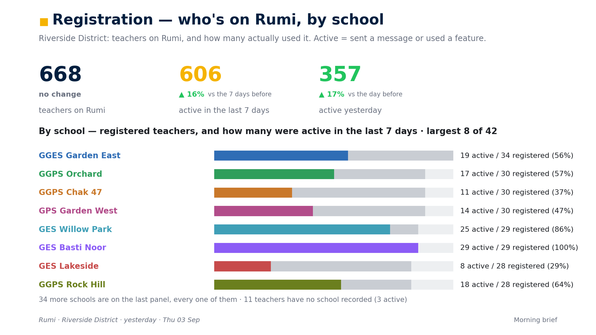

# brief/ — the Morning Brief

Every morning, your programme's team wakes up to one message thread that answers five plain
questions, each with a number behind it: who is on the platform and who actually used it · are
teachers teaching with the lesson plans · is the teaching improving · are the coaches showing up
against their target · where should attention go next. **Same charts, same cohort, same window,
every morning — so what changed is visible at a glance.** On Fridays the same thread rolls the week
up.

It arrives wherever your deployment already talks — **WhatsApp, Slack or Discord** — through the
bot's own channel drivers, and it leaves a live page in the dashboard behind it. No new credentials:
one read-only database URL and a list of recipients.

[](https://github.com/Orenda-Project/rumi-platform/releases/download/v2.2.0/Morning_Brief_Every_Morning.mp4)

*An 81-second film (click to play). And the brief itself:*



*A synthetic programme. Every panel of the sample daily and weekly brief is in [`sample/`](sample/),
with the captions that go beside them in `THREAD.md`. Nothing in it is a real person or school.*

## Quick start

```bash
python3 -m venv .venv && source .venv/bin/activate   # any Python 3.9+; a venv keeps system Python untouched
pip install matplotlib numpy 'psycopg[binary]'       # the only Python dependencies

# .env — three lines are enough
BRIEF_DATABASE_URL=postgresql://…                  # a READ-ONLY role; falls back to DATABASE_URL
BRIEF_RECIPIENTS=923001234567, slack:channel:C0123ABC, discord:channel:9182736450
BRIEF_TZ=Asia/Karachi                              # the zone the programme lives in

rumi brief                    # render this morning's brief (a dry run — nothing is sent)
rumi brief --send             # render and deliver it to every recipient
rumi brief --weekly --send    # the weekly roll-up
```

`python3 brief/cli.py check` tells you, before anything renders, which panels **this** database can
draw. Then schedule `node bot/workers/brief.worker.js` once a day (Railway Cron, crontab, GitHub
Actions — anything that can run a command at 09:00 in your zone). The worker decides for itself
whether today is a daily, the weekly, or an off-day: a code-level day guard, so a mis-set schedule
cannot produce a brief on the wrong day.

## What a brief contains

| # | Panel | The question it answers |
|---|---|---|
| 0 | Cover | which programme, which day, daily or weekly |
| 1 | Registration | how many teachers are on the platform, how many were **active** (a real event, never a stored "last seen"), broken down by the organising unit |
| 2 | Teach Well — lesson plans | the share of teachers who made a lesson plan each day, with the whole programme in bold and (when there are few units) one thin dotted line per unit |
| 3 | Improve — AI coaching | the share of teachers who recorded and scored their own lesson |
| 4 | Score trend | the daily average of every scored session, dot size = sessions that day, 60 days |
| 5 | Sub-indicators | each area of the coaching framework, weakest first, with its move |
| 6 | Reading | students assessed, share on track for their grade, median words-correct-per-minute by grade |
| 7 | Everything else | quizzes, attendance, exams checked, videos — only the features your deployment has tables for |
| 8 | Observations | **only if your fork records classroom observations** — every observer against the target, gold ★ above, grey for zero |
| 9 | Where to point attention | **every** unit, worst first, colour-ramped by the share of its teachers active in the last 7 days |

Every headline carries a delta chip against the comparison window — yesterday for a daily, the
previous week for the weekly — recomputed from the raw events over the shifted window, so a chip
always compares like with like. Counts compare relatively above a base of twenty and absolutely
below it; percentages compare in points; a missing baseline says so.

## Definitions — the SQL in `brief/pull.py`, in prose

These are the rules a team will ask about. They are one place in code and one place here; a change
lands in both.

- **Cohort.** `users` with `registration_completed` and not `is_test_user`, optionally narrowed by
  `BRIEF_REGION` (`users.region`) and/or `BRIEF_ORGANIZATION` (`users.organization`).
- **Organising unit.** One column on `users` — `BRIEF_GROUP_BY`, default `school_name`, or `region`
  or `organization`. Teachers with no value are shown as "No unit recorded", never dropped.
- **Active teacher.** Originated at least one event that day: a message (`conversations` with
  `role='user'`), a lesson plan, a coaching session, a reading assessment, a quiz session or an
  attendance session. Union, distinct by teacher.
- **Day.** Every timestamp is converted to `BRIEF_TZ` before it becomes a date. A morning brief
  covers the previous **working** day — Monday's brief is about Friday. `BRIEF_LAG=0` makes it an
  evening brief about the same day.
- **Week.** The seven days ending on the covered day (Friday's roll-up is last Friday to Thursday).
- **Lesson plans.** `lesson_plans` rows; "made" means generated and sent, not a confirmed opening.
- **AI coaching.** `coaching_sessions` with `status='completed'`, by `completed_at`. The score is
  `analysis_data.scores.overall_percentage`; the sub-indicators are whatever your framework writes
  under `analysis_data.domains` (or `.areas`) as `{area_score, area_max}` — the panel is
  framework-agnostic and labels itself from `analysis_data.framework`.
- **Reading.** `reading_assessments` with `status='completed'`; `wcpm`, `on_track`, `grade_level`.
- **Observations** (forks only). Switches on when `coaching_sessions` has `observation_type` and
  `observer_user_id`. The roster is everyone who has ever observed a teacher in the cohort; targets
  are `BRIEF_OBS_TARGET_DAILY` (2) and `BRIEF_OBS_TARGET_WEEKLY` (10) per observer.
- **Where to point attention.** For each unit, registered teachers and the share active in the last
  7 days; sorted worst first.

## Where it goes

```
brief/out/latest/<daily|weekly>/manifest.json   the newest brief (+ its PNGs)
brief/out/archive/<kind>/<day>/…                history, one folder per covered day
```

`manifest.json` is the contract everything else reads: the panels in order, a caption for each, the
lead text, the closer, and the live link. The bot's sender (`bot/scripts/brief/send-brief.js`) posts
the cover with the lead, then each panel with its caption, then the closer — to every target in
`BRIEF_RECIPIENTS`, through the same channel drivers the bot uses for teachers. It records what it
sent beside the manifest, so a re-run never double-posts.

When `SUPABASE_URL` and `SUPABASE_SERVICE_ROLE_KEY` are set, the same files are mirrored to a public
storage bucket named `brief`, and the dashboard's **`/observability/brief`** page shows the latest
daily and weekly from wherever it runs; `/observability/brief/screen?p=N` is a single panel that
refreshes itself — for an office wall. Put that URL in `BRIEF_LIVE_URL` and every brief ends with it.

## Recipients

| Target | Means |
|---|---|
| `923001234567` | a WhatsApp number (Meta Cloud API or the linked-device sandbox) |
| `120363…@g.us` | a WhatsApp group (linked-device driver) |
| `slack:U0123ABC` · `slack:channel:C0123ABC` | a Slack person · a Slack channel |
| `discord:9182…` · `discord:channel:9182…` | a Discord person · a Discord channel |

Pilot to yourself first. Send to a team channel only once you have read a real brief and agree with
every number on it — a recurring send is a promise.

## Tests

```bash
python3 -m unittest discover -s brief/tests -t brief -p 'test_*.py'   # offline: fakes, no database
```

The suite pins the definitions above (the cohort filter, the event-based "active", the timezone
boundary, the comparison windows), the calendar, the PCHIP smoothing, the manifest contract, and
renders both sample briefs end to end. A green suite is necessary, not sufficient: the layout
defects that matter are only ever found by opening the PNGs — `python3 brief/cli.py sample` makes
that a thirty-second habit.

## Customise

- **Brand and name.** `BRIEF_BRAND_NAME` (default `Rumi`) and `BRIEF_PROGRAMME_NAME` (the cover
  title). Drop a 1600×900 JPEG at `brief/brief/assets/cover_bg.jpg` (or point `BRIEF_COVER_BG` at
  one) and the cover carries your landmark under the navy gradient.
- **Cadence.** `BRIEF_DAILY_DOWS=1,2,3,4` and `BRIEF_WEEKLY_DOW=5` (Sunday = 0) in the worker;
  `BRIEF_LAG` for morning vs evening.
- **A new panel.** Add a query in `pull.py` (tag it `/* name */` so the offline tests can route
  canned rows), a drawing function in `render.py`, a caption in `compose.py`, and gate it on the
  schema in `schema.py` so a deployment without the table simply does not draw it.

We call this the Routine Data Flow internally; it runs on us first, every morning, in every region.
